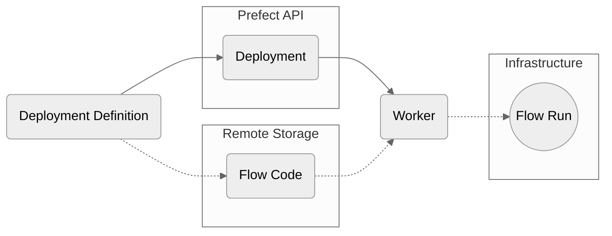

ワークプールは、Prefect オーケストレーション層とフローが実行されるインフラストラクチャをつなぐ橋渡し役です。

ワークプールを使用する主な理由は、**動的なインフラストラクチャのプロビジョニングと構成** です。
例えば、インフラストラクチャの要件が高く、実行頻度が低いワークフローがあるとします。
このような場合、そのインフラストラクチャ内でアイドル状態のプロセスが実行されることは望ましくありません。

ワークプールのその他の利点：

- すべてのジョブが継承し、上書き可能なデフォルトのインフラストラクチャ構成をワークプールに構成できます。
- プラットフォームチームがワークプールを使用することで、監視対象のインフラストラクチャに独自の（かつ強制的な）インターフェースを公開できます。
- ワークプールは、[ワークキュー](/v3/deploy/infrastructure-concepts/work-pools/#work-queues) を使用することで、フロー実行の優先順位付け（または制限）を行うことができます。

<Tip>
**`flow.deploy()` と `flow.serve()` の選択**

多くのユースケースでは、スケジューリングとオーケストレーションには `serve` で十分です。
ワークプールは複雑なインフラストラクチャ要件に最適ですが、オプションです。
1つの方法に限定されるわけではなく、必要に応じて複数のアプローチを組み合わせることができます。
</Tip>


ワークプールには異なる運用モードがあり、それぞれ特定のインフラストラクチャと作業配信方法に対応するように設計されています:

1. プルワークプール：ワーカーはフロー実行の実行を能動的にポーリングする必要があります。
2. [プッシュワークプール](/v3/deploy/infrastructure-examples/serverless)：サーバーレスインフラストラクチャプロバイダーに実行を直接送信します。
3. [マネージドワークプール](/v3/deploy/infrastructure-examples/managed)：Prefect によって管理され、コードの送信と実行の両方を処理します。

各タイプのワークプールは異なるユースケースに合わせて最適化されているため、特定のインフラストラクチャとワークフローの要件に最適なものを選択できます。
ワークプールを使用することで、複数の環境とインフラストラクチャにわたる Prefect フローの分散と実行を効率的に管理できます。

<Tip>
**ワークプールはPub/Subトピックに似ています**

ワークプールは、プール自体という既知のチャネルを介して、ワーカーとデプロイメントの連携を支援します。これは、Pub/Subまたはメッセージベースのシステムでプロデューサーとコンシューマーを接続するために「トピック」が使用される方法に似ています。
デプロイメントのワークプールを切り替えることで、ユーザーは実行を実行するワーカーを素早く変更できるため、環境間での実行のプロモートや、ローカルでのデバッグが容易になります。
</Tip>

ユーザーは、プールで同時に実行できる実行数など、ワークプールの動作を制御できます。
これらのオプションはいつでも変更でき、特定のプールの作業を要求するワーカーには、一致するフロー実行のみが表示されます。

次の図は、ワーカーによってポーリングされ、そのデプロイメントに基づいてフロー実行を実行するワークプールベースのデプロイメントの定義に関係する概念要素の概要を示しています。



### ワークプールの設定

Prefect UI を使用してワークプールを設定できます。

UI でワークプールを管理するには、**ワークプール** アイコンをクリックします。現在設定されているワークプールのリストが表示されます。


**+** ボタンを選択して新しいワークプールを作成します。このワークプール用に作成されるインフラストラクチャの詳細を指定できます。

#### CLIの使用

import { CLI } from "/snippets/resource-management/cli.mdx"
import { work_pools } from "/snippets/resource-management/vars.mdx"

<CLI name="work pools" href={work_pools.cli} />

```bash
prefect work-pool create [OPTIONS] NAME
```

`NAME` は、作業プールの必須の一意の名前です。

プール上の作業をフィルタリングするためのオプションの設定パラメータは次のとおりです:

| Option                                             | Description                                                                                                                                                |
| -------------------------------------------------- | ---------------------------------------------------------------------------------------------------------------------------------------------------------- |
| `--paused`                                         | 指定されている場合、作業プールは一時停止状態で作成されます。             |
| `--type`                                           | この作業プールから実行できるインフラストラクチャのタイプ。  |
| `--set-as-default`                                 | 作成された作業プールをデプロイメントのローカルデフォルトとして使用するかどうか。     |
| <span class="no-wrap">`--base-job-template`</span> | 使用するベースジョブテンプレートを含むJSONファイルへのパス。指定されていない場合、Prefectは指定されたワーカータイプのデフォルトのベースジョブテンプレートを使用します。|

作業プールを更新するために指定できるオプションの構成パラメータは次のとおりです:

| Option                                             | Description                                                                                                                                                |
| -------------------------------------------------- | ---------------------------------------------------------------------------------------------------------------------------------------------------------- |
| <span class="no-wrap">`--base-job-template`</span> | 使用するベースジョブテンプレートを含むJSONファイルへのパス。指定されていない場合、Prefectは指定されたワーカータイプのデフォルトのベースジョブテンプレートを使用します。 |
| `--description`                                    | 作業プールの説明。 |
| `--concurrency-limit`                              | 作業プールで同時に実行されるフロー実行の最大数。    |

<Tip>
**CI/CD でのワークプールの管理**

ベースジョブテンプレートを JSON ファイルとして Git リポジトリにコミットすることでバージョン管理を行い、CI/CD パイプラインで `prefect work-pool update` コマンドを使用してワークプールのベースジョブテンプレートの更新を管理します。

例えば、ワークプールのベースジョブテンプレートを `base-job-template.json` というファイルの内容に更新するには、次のコマンドを使用します。

    ```bash
    prefect work-pool update --base-job-template base-job-template.json my-work-pool
    ```
</Tip>

#### Using Terraform

import { TF } from "/snippets/resource-management/terraform.mdx"

<TF name="work pools" href={work_pools.tf} />

#### Using the REST API

import { API } from "/snippets/resource-management/api.mdx"

<API name="work pools" href={work_pools.api} />

### Work pool types

Prefect では次の作業プール タイプがサポートされています:

<Tabs>
  <Tab title="Prefect Cloud">

    | Infrastructure Type                  | Description                                                                                                                |
    | ------------------------------       | -------------------------------------------------------------------------------------------------------------------------- |
    | Process                              | 実行フローはワーカー上のサブプロセスとして実行されます。初めて使用する場合は、ローカル実行に適しています。 |
    | AWS Elastic Container Service        | AWS ECS上のコンテナ内でフローを実行します。EC2およびFargateクラスターで動作します。AWSアカウントが必要です。  |
    | Azure Container Instances            | 実行フローは、Azure の Container Instances サービス上のコンテナー内で実行されます。Azure アカウントが必要です。  |
    | Docker                               | Dockerコンテナ内でフローを実行します。Dockerイメージを介したフロー実行環境の管理に適しています。実行中のDockerデーモンへのアクセスが必要です。 |
    | Google Cloud Run                     | Google Cloud Run 上のコンテナ内でフローを実行します。Google Cloud Platform アカウントが必要です。  |
    | Google Cloud Run V2                  | Google Cloud Run（V2 API）上のコンテナ内でフローを実行します。Google Cloud Platform アカウントが必要です。    |
    | Google Vertex AI                     | フロー実行は Google Vertex AI 上のコンテナ内で実行されます。Google Cloud Platform アカウントが必要です。         |
    | Kubernetes                           | 実行フローは、Kubernetes クラスターでスケジュールされたジョブ内で実行されます。Kubernetes クラスターが必要です。    |
    | Google Cloud Run - Push              | Google Cloud Run 上のコンテナ内でフロー実行を実行します。Google Cloud Platform アカウントが必要です。フロー実行は、Prefect Worker を必要とせず、環境に直接プッシュされます。 |
    | AWS Elastic Container Service - Push | AWS ECS上のコンテナ内でフロー実行を実行します。既存のECSクラスターと連携し、AWS Fargateを介したサーバーレス実行も可能です。AWSアカウントが必要です。フロー実行はPrefectワーカーを必要とせず、環境に直接プッシュされます。  |
    | Azure Container Instances - Push     | Azure Container Instances サービス上のコンテナ内でフロー実行を実行します。Azure アカウントが必要です。フロー実行は、Prefect Worker を必要とせず、環境に直接プッシュされます。  |
    | Modal - Push                         | [フローはModal上で実行](/v3/deploy/infrastructure-examples/modal)を実行します。Modalアカウントが必要です。フロー実行はPrefectワーカーを必要とせず、Modalワークスペースに直接プッシュされます。  |
    | Coiled                               | Coiled を使えば、任意のクラウドプラットフォームでフローを実行できます。Kubernetes やその他のクラウドインフラストラクチャをセットアップすることなく、アカウント内で簡単に実行できます。  | 
    | Prefect Managed                      | Prefect 管理インフラストラクチャ上のコンテナ内でフロー実行を実行します。  |
  </Tab>
  <Tab title="Self-hosted Prefect server">

    | Infrastructure Type           | Description              |
    | ----------------------------  | ------------------------ |
    | Process                       | 実行フローはワーカー上のサブプロセスとして実行されます。初めて使用する場合は、ローカル実行に適しています。   |
    | AWS Elastic Container Service | AWS ECS上のコンテナ内でフローを実行します。EC2およびFargateクラスターで動作します。AWSアカウントが必要です。 |
    | Azure Container Instances     | 実行フローは、Azure の Container Instances サービス上のコンテナー内で実行されます。Azure アカウントが必要です。 |
    | Docker                        | Dockerコンテナ内でフローを実行します。Dockerイメージを介したフロー実行環境の管理に適しています。実行中のDockerデーモンへのアクセスが必要です。  |
    | Google Cloud Run              | Google Cloud Run 上のコンテナ内でフローを実行します。Google Cloud Platform アカウントが必要です。   |
    | Google Cloud Run V2           | Google Cloud Run（V2 API）上のコンテナ内でフローを実行します。Google Cloud Platform アカウントが必要です。   |
    | Google Vertex AI              | フロー実行は Google Vertex AI 上のコンテナ内で実行されます。Google Cloud Platform アカウントが必要です。  |
    | Kubernetes                    | 実行フローは、Kubernetes クラスターでスケジュールされたジョブ内で実行されます。Kubernetes クラスターが必要です。      |
  </Tab>
</Tabs>

### ワークプールの表示

ユーザーはいつでも、Prefect UI で設定済みのワークプールを表示および編集できます。

Prefect CLI でワークプールを表示するには、次の操作を行います。

- 利用可能なすべてのプールを一覧表示する (`ls`)
- 特定のプールの詳細を確認する (`inspect`)
- 特定のプールにスケジュールされている作業をプレビューする (`preview`)

`prefect work-pool ls` は、サーバーに設定されているすべてのワークプールを一覧表示します。

```bash
prefect work-pool ls
```

例えば：

```bash
                               Work pools
__________________________________________________________________________________________
| Name       |    Type        |                                   ID | Concurrency Limit |
__________________________________________________________________________________________
| barbeque   | docker         | 72c0a101-b3e2-4448-b5f8-a8c5184abd17 | None              |
| k8s-pool   | kubernetes     | 7b6e3523-d35b-4882-84a7-7a107325bb3f | None              |
| my-pool    | process        | cd6ff9e8-bfd8-43be-9be3-69375f7a11cd | None              |
__________________________________________________________________________________________
                       (**) denotes a paused pool
```

`prefect work-pool inspect` は、ID によって特定のワークプールのすべての構成メタデータを提供します。

```bash
prefect work-pool inspect 'test-pool'
```

次のような情報を出力します:

```bash
WorkPool(
    id='a51adf8c-58bb-4949-abe6-1b87af46eabd',
    created=DateTime(2024, 1, 1, 1, 1, 1, 1),
    updated=DateTime(2024, 1, 1, 1, 1, 1, 1),
    name='test-pool',
    type='process',
    base_job_template={...},
    status=WorkPoolStatus.READY,
    default_queue_id=<Queue ID>,
)
```

`prefect work-pool preview` は、特定のワークプールの今後1時間のスケジュールされたフロー実行をID別に表示します。
オプションの `--hours` フラグを使用すると、先読みする時間数を指定できます。

```bash
prefect work-pool preview 'test-pool' --hours 12
```

```bash
_____________________________________________________________________________________________
| Scheduled Star… | Run ID                     | Name         | Deployment ID               |
_____________________________________________________________________________________________
| 2022-02-26 06:… | 741483d4-dc90-4913-b88d-0… | messy-petrel | 156edead-fe6a-4783-a618-21… |
| 2022-02-26 05:… | 14e23a19-a51b-4833-9322-5… | unselfish-g…  | 156edead-fe6a-4783-a618-21… |
| 2022-02-26 04:… | deb44d4d-5fa2-4f70-a370-e… | solid-ostri… | 156edead-fe6a-4783-a618-21… |
| 2022-02-26 03:… | 07374b5c-121f-4c8d-9105-b… | sophisticat… | 156edead-fe6a-4783-a618-21… |
| 2022-02-26 02:… | 545bc975-b694-4ece-9def-8… | gorgeous-mo… | 156edead-fe6a-4783-a618-21… |
| 2022-02-26 01:… | 704f2d67-9dfa-4fb8-9784-4… | sassy-hedge… | 156edead-fe6a-4783-a618-21… |
| 2022-02-26 00:… | 691312f0-d142-4218-b617-a… | sincere-moo… | 156edead-fe6a-4783-a618-21… |
| 2022-02-25 23:… | 7cb3ff96-606b-4d8c-8a33-4… | curious-cat… | 156edead-fe6a-4783-a618-21… |
| 2022-02-25 22:… | 3ea559fe-cb34-43b0-8090-1… | primitive-f… | 156edead-fe6a-4783-a618-21… |
| 2022-02-25 21:… | 96212e80-426d-4bf4-9c49-e… | phenomenal-… | 156edead-fe6a-4783-a618-21… |
_____________________________________________________________________________________________
                                   (**) denotes a late run
```

### ワークプールのステータス

ワークプールには以下の3つのステータスがあります。

- `READY`: ワークプールに少なくとも1つのオンラインワーカーがいて、ハートビートを送信しています。
- `NOT_READY`: ワークプールにオンラインワーカーがいません。
- `PAUSED`: ワークプールは、手動または自動化によって一時停止状態にすることができます。一時停止中のワークプールが一時停止解除されると、ハートビートを送信しているワーカーの有無に基づいて、適切なステータスが再割り当てされます。

### ワークプールの一時停止と削除

ワークプールはいつでも一時停止して、ワーカーへの作業の配信を停止できます。一時停止中のプールをポーリングしても、ワーカーは作業を受け取りません。

Prefect CLI 経由でワークプールを一時停止するには、「prefect work-pool pause」コマンドを使用します:

```bash
prefect work-pool pause 'test-pool'
```

Prefect CLI を介してワーク プールを再開するには、ワーク プール名を指定した `prefect work-pool resume` コマンドを使用します。

<Note>
**ワークプールを一時停止しても、デプロイメントスケジュールは一時停止されません**

ワークプールを一時停止しても、そのワークプールに関連付けられているデプロイメントのスケジュールは一時停止**されません**。
関連付けられているデプロイメントのフロー実行は引き続きスケジュールされますが、ワークプールの一時停止が解除されるまで実行されません。
</Note>

Prefect CLI を使用してワーク プールを削除するには、ワーク プール名を指定した `prefect work-pool delete` コマンドを使用します。

### 同時実行の管理

各ワークプールは、オプションで、一致するフローの同時実行を制限できます。

例えば、同時実行制限が5に設定されているワークプールでは、一致するフローのうち「実行中」または「保留中」の状態にあるフローが5つ未満の場合にのみ、新しいワークがリリースされます。
「実行中」または「保留中」の状態にあるフローが3つある場合、プールでワークをポーリングしても、同時実行制限を超えないように、利用可能なフローがさらに多くあっても、新しいフローは2つしかリリースされません。

Prefect CLI コマンド「prefect work-pool」を使用してワークプールを構成する場合、以下のサブコマンドで同時実行制限を設定します。

- `set-concurrency-limit` は、ワークプールの同時実行制限を設定します。
- `clear-concurrency-limit` は、ワークプールからすべての同時実行制限をクリアします。

#### ベースジョブテンプレート

各ワークプールには、ワークプールからフロー実行を実行するワーカーの動作を制御するベースジョブテンプレートがあります。

ベースジョブテンプレートは、フロー実行ごとにワーカーに渡される構成と、デプロイメント作成者がデプロイメントごとにワーカーの動作をカスタマイズするために利用できるオプションを定義するコントラクトとして機能します。

ベースジョブテンプレートは、`job_configuration` セクションと `variables` セクションで構成されます。

`variables` セクションでは、デプロイメントまたはフロー実行ごとにカスタマイズできるフィールドを定義します。`variables` セクションは [OpenAPI 仕様](https://swagger.io/specification/) に準拠しており、ワークプール作成者は指定値（タイプ、最小値、最大値など）に制限を設定できます。

ジョブ構成セクションは、variables セクションで指定された値で補間されます。
作成されたドキュメントは、フロー実行の実行時に作成される環境を構成するために使用されます。

`job_configuration` 内の値には、プレースホルダーを使用して、`variables` セクションで指定された値またはハードコードされた値を参照できます。
プレースホルダーは二重の中括弧で宣言します（例：`{{variable_name}}`）。

JSON で定義されたベースジョブテンプレートの例を次に示します。

```json
{
  "job_configuration": {
    "command": "{{ command }}",
    "env": "{{ env }}",
    "labels": "{{ labels }}",
    "name": "{{ name }}",
    "stream_output": "{{ stream_output }}",
    "working_dir": "{{ working_dir }}"
  },
  "variables": {
    "type": "object",
    "properties": {
      "name": {
        "title": "Name",
        "description": "Name given to infrastructure created by a worker.",
        "type": "string"
      },
      "env": {
        "title": "Environment Variables",
        "description": "Environment variables to set when starting a flow run.",
        "type": "object",
        "additionalProperties": {
          "type": "string"
        }
      },
      "labels": {
        "title": "Labels",
        "description": "Labels applied to infrastructure created by a worker.",
        "type": "object",
        "additionalProperties": {
          "type": "string"
        }
      },
      "command": {
        "title": "Command",
        "description": "The command to use when starting a flow run. In most cases, this should be left blank and the command will be automatically generated by the worker.",
        "type": "string"
      },
      "stream_output": {
        "title": "Stream Output",
        "description": "If enabled, workers will stream output from flow run processes to local standard output.",
        "default": true,
        "type": "boolean"
      },
      "working_dir": {
        "title": "Working Directory",
        "description": "If provided, workers will open flow run processes within the specified path as the working directory. Otherwise, a temporary directory will be created.",
        "type": "string",
        "format": "path"
      }
    }
  }
}
```

各ワークプールタイプにはデフォルトのベースジョブテンプレートが設定されており、初期変更を行うのに適しています。
デフォルトのベーステンプレートは、すべてのフロー実行に渡される値を定義しますが、デプロイメントごとまたはフロー実行ごとにオーバーライドできます。

例えば、Prefect UI の「プロセス」ワークプールでは、次の設定オプションが利用可能です:


デフォルトのベースジョブテンプレートでは、以下の操作が可能です:
- 生成されたプロセスの環境変数を設定する
- フローを実行する作業ディレクトリを設定する
- フロー実行の出力をワーカーの標準出力にストリーミングするかどうかを制御する

以下のコマンドを実行することで、特定のワーカータイプのデフォルトのベースジョブテンプレートの生データを確認できます:

```bash
prefect work-pool get-default-base-job-template --type process
```

各属性は、デプロイメントごと、またはフロー実行ごとにオーバーライドできます。
デプロイメントを作成する際に、`prefect.yaml` ファイルの `deployments.work_pool.job_variables` セクション、または Python の `flow.deploy` メソッドの `job_variables` 引数でこれらのオーバーライドを指定できます。

たとえば、特定のデプロイメントのストリーミング出力をオフにするには、`prefect.yaml` に次のコードを追加します:

```yaml
deployments:
- name: demo-deployment
  entrypoint: demo_project/demo_flow.py:some_work
  work_pool:
    name: above-ground  
    job_variables:
        stream_output: false
```

Learn more about [customizing job variables](/v3/deploy/infrastructure-concepts/customize).

<Tip>
**ベースジョブテンプレートの高度なカスタマイズ**

高度なユースケースでは、完全にカスタマイズ可能なジョブテンプレートを使用してワークプールを作成します。
このカスタマイズは、UI 内の「詳細」タブでワークプールを作成または編集する場合、または Prefect CLI 経由でワークプールを更新する場合に利用できます。

高度なカスタマイズは、基盤となるインフラストラクチャが高度なカスタマイズをサポートしている場合に役立ちます。
このようなシナリオでは、ワークプールのジョブテンプレートを使用することで、デプロイメント作成者に最小限かつ分かりやすいオプションセットを提供できます。
さらに、これらのオプションはデプロイメントインフラストラクチャでカスタマイズ可能な唯一の要素であり、セキュアな環境で機能を制限するのに役立ちます。
例えば、`kubernetes` ワーカータイプでは、ユーザーはカスタムジョブテンプレートを指定して、ワーカーがフロー実行用のジョブを作成するために使用するマニフェストを構成できます。

[ワークプールのジョブ変数のオーバーライド](/v3/deploy/infrastructure-concepts/customize) の詳細については、こちらをご覧ください。
</Tip>

### ワークキュー

ワークキューは、実行方法を詳細に制御する機能を提供します。
各ワークプールには「デフォルト」キューがあり、別のワークキュー名が指定されていない場合に使用されます。
ワークプールにキューを追加することで、きめ細かな優先度と同時実行性を実現し、作業の配信をより詳細に制御できます。


#### キューの優先度

各作業キューには、一意の正の整数で示される優先度があります。
作業の割り当てにおいては、数値が小さいほど優先度が高くなり、「1」が最高優先度となります。
優先度の高いキューのランクを変更せずに、新しいキューを追加できます。

#### キューの同時実行制限

ワークキューにも独自の同時実行制限を設定できます。
各キューには、グローバルワークプールの同時実行制限も適用され、この制限を超えることはできません。

#### 優先度と同時実行による正確な制御

作業キューの優先度と同時実行を組み合わせることで、作業を的確に制御できます。例えば、プールに次の3つのキューがあるとします。

- 優先度が「10」で同時実行制限のない「低」キュー
- 優先度が「5」で同時実行制限が「3」の「高」キュー
- 優先度が「1」で同時実行制限が「1」の「クリティカル」キュー

この構成により、2段階の優先度パターンが可能になります。「高」と「低」のキューは定期的にスケジュールされたフロー実行に使用し、残りの「クリティカル」キューはバックフィルなどの計画外の緊急作業に使用します。

優先度は、実行のために送信されるフロー実行の順序を決定します。

すべてのフロー実行が同時実行などの制限なしに実行可能な場合、優先度は送信順序の決定に使用されますが、実行には影響しません。

通常は同時実行制限の結果として、すべてのフロー実行を実行できない場合、優先度によってどのキューが実行のために優先的に送信されるかが決まります。

フロー実行の送信優先度は、最高優先度から最低優先度へと順に決定されます。
前の例では、「critical」（優先度1）キューのすべての作業が送信され、「high」（優先度5）キューの作業が送信される前に送信されます。
優先度キュー「critical」のすべての作業が送信されると、「high」キューの作業の送信が開始されます。

フロー実行が「high」キューと「low」キューでまだ​​スケジュールされている間に、「critical」キューで新しいフロー実行が受信された場合、フロー実行の送信は、スケジュールされているすべての作業が最初に満たされるように行われます。これは、最高優先度キューから空になるまで、ウォーターフォール方式で行われます。

<Tip>
**ワークキューのステータス**

ワークキューは、過去60秒間にワーカーによってポーリングされている場合、ステータスが「READY」になります。
ワークキューを一時停止すると、ステータスは「PAUSED」になり、一時停止が解除されるまで新しい作業を受け付けなくなります。
ユーザーはUIでワークキューの一時停止ステータスを制御できます。
ワークキューの一時停止を解除すると、過去60秒間にワーカーによってポーリングされていない限り、ステータスは「NOT_READY」になります。
</Tip>

## 次のステップ

- [ワーカー](/v3/deploy/infrastructure-concepts/workers) と、それらがワークプールとどのように連携するかについて詳しく学習します。
- ワークプールで実行される [フローのデプロイ](/v3/deploy/infrastructure-concepts/prefect-yaml) の方法を学びます。
- 以下のワークプールの設定方法を学びます。
  - [Kubernetes](/v3/deploy/infrastructure-examples/kubernetes)
  - [Docker](/v3/deploy/infrastructure-examples/docker)
  - [サーバーレス プラットフォーム](/v3/deploy/infrastructure-examples/serverless)
  - [Prefect Cloud によって管理されるインフラストラクチャ](/v3/deploy/infrastructure-examples/managed)
