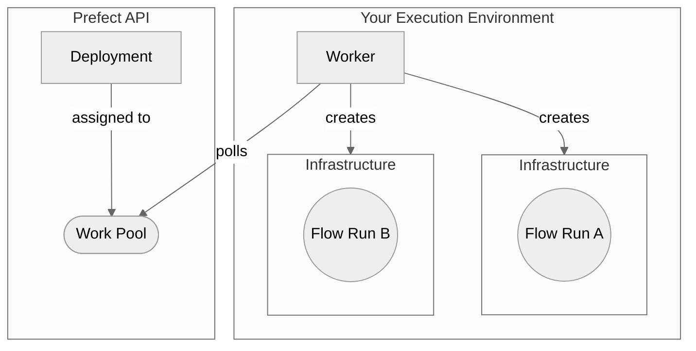

ワーカーは、ワークプールからスケジュールされた実行を取得して実行する軽量ポーリングサービスです。

ワーカーにはそれぞれ、フロー実行を送信する実行環境に対応するタイプがあります。
ワーカーは、自身のタイプに一致するワークプールのみをポーリングできます。
そのため、デプロイメントがワークプールに割り当てられると、そのデプロイメントに対してスケジュールされたフロー実行がどの実行環境で実行されるかがわかります。

次の図は、ワーカーベースのワークプールデプロイメントのアーキテクチャをまとめたものです:



ワーカーは、_フロー実行インフラストラクチャ_のプロビジョニングを担当します。

### ワーカータイプ

利用可能なワーカータイプのリストを以下に示します。
ほとんどのワーカータイプでは、追加パッケージのインストールが必要です。

| Worker Type | Description | Required Package |
| --- | --- | --- |
| [`process`](https://reference.prefect.io/prefect/workers/process/) | サブプロセスでフロー実行を行います | |
| [`kubernetes`](https://reference.prefect.io/prefect_kubernetes/worker/) | フロー実行をKubernetesジョブとして実行する | `prefect-kubernetes` |
| [`docker`](https://reference.prefect.io/prefect_docker/worker/) | Dockerコンテナ内でフロー実行を実行します | `prefect-docker` |
| [`ecs`](https://reference.prefect.io/prefect_aws/workers/ecs_worker/) | フロー実行をECSタスクとして実行する | `prefect-aws` |
| [`cloud-run-v2`](https://reference.prefect.io/prefect_gcp/workers/cloud_run_v2/) | フロー実行を Google Cloud Run ジョブとして実行する | `prefect-gcp` |
| [`vertex-ai`](https://reference.prefect.io/prefect_gcp/workers/vertex/) | フロー実行を Google Cloud Vertex AI ジョブとして実行します | `prefect-gcp` |
| [`azure-container-instance`](https://reference.prefect.io/prefect_azure/workers/container_instance/) | ACIコンテナでフローを実行する| `prefect-azure` |
| [`coiled`](https://github.com/coiled/prefect-worker/blob/main/example/README.md) | Coiledを使用してクラウドでフローを実行する | `prefect-coiled` |

ニーズを満たすワーカー タイプが見つからない場合は、[新しいワーカー タイプの開発](/contribute/develop-a-new-worker-type/)を検討してください。

### ワーカーオプション

ワーカーは、ワークプール内の1つ以上のキューから作業をポーリングします。
ワーカーが参照するワークキューが存在しない場合には、自動的に作成されます。
ワーカーCLIは、ワークプールからワーカータイプを推測します。
ワーカータイプを明示的に指定することもできます。
ワーカーCLIにワーカータイプを指定すると、ワークプールが存在しない場合は自動的に作成されます（デフォルトのジョブ設定を使用）。

ワーカーを起動するときに指定できる構成パラメータは次のとおりです:

| Option                                            | Description                                                                                                                                 |
| ------------------------------------------------- | ------------------------------------------------------------------------------------------------------------------------------------------- |
| `--name`, `-n`                                    | 開始したワーカーに付ける名前。指定しない場合は、一意の名前が生成されます。  |
| `--pool`, `-p`                                    | 開始されたワーカーがポーリングする必要がある作業プール。   |
| `--work-queue`, `-q`                              | ワーカーがプルする1つ以上のワークキュー名。指定しない場合、ワーカーはワークプール内のすべてのワークキューからプルします。   |
| `--type`, `-t`                                    | 開始するワーカーのタイプ。指定しない場合は、ワーカータイプはワークプールから推測されます。   |
| <span class="no-wrap">`--prefetch-seconds`</span> | フロー実行の予定開始時刻の何時間前に送信を開始するかを指定します。デフォルトは `PREFECT_WORKER_PREFETCH_SECONDS` の値です。 |
| `--run-once`                                      | ワーカーポーリングは 1 回だけ実行します。デフォルトでは、ワーカーは永久に実行されます。 |
| `--limit`, `-l`                                   | 同時に開始するフロー実行の最大数。   |
| `--with-healthcheck`                                   | ワーカーのヘルスチェック サーバーを起動します。   |
| `--install-policy`                                   | Prefect 統合パッケージのワーカーを使用するためのポリシーをインストールします。  |

フロー実行に必要なインフラストラクチャにアクセスまたは作成するには、環境内でワーカーを起動する必要があります。
ワーカーは、ワーカータイプに対応するインフラストラクチャにフロー実行をデプロイします。
例えば、タイプ「kubernetes」でワーカーを起動すると、ワーカーはフロー実行をKubernetesクラスターにデプロイします。

ワーカーを実行したりフロー実行を実行したりする環境（仮想環境、Dockerコンテナなど）には、Prefectがインストールされている必要があります。

<Tip>
**ワーカーの `PREFECT_API_URL` と `PREFECT_API_KEY` の設定**

ワーカーが実行される環境に合わせて `PREFECT_API_URL` を設定する必要があります。
また、`Worker` ロールを持つユーザーまたはサービスアカウントも必要です。これは `PREFECT_API_KEY` を設定することで設定できます。
</Tip>

### ワーカーのステータス

ワーカーには「ONLINE」と「OFFLINE」の2つのステータスがあります。
ワーカーがPrefect APIに定期的にハートビートメッセージを送信している場合、そのワーカーはオンライン状態です。
ワーカーがハートビートを3回受信できなかった場合、オフライン状態とみなされます。
デフォルトでは、ワーカーはハートビートの送信を停止してから最大90秒間オフライン状態とみなされますが、「PREFECT_WORKER_HEARTBEAT_SECONDS」設定でしきい値を設定できます。

### ワーカーログ
<span class="badge cloud"></span> Prefect Cloud に接続している場合、ワーカーはログを Prefect Cloud API に送信します。

- すべてのワーカーログは自動的に Prefect Cloud API に送信されます。
- ログは Prefect Cloud UI と API の両方からアクセスできます。
- 各フロー実行には、関連するワーカーログへのリンクが含まれます。

### ワーカーの詳細
<span class="badge cloud"></span> **ワーカーの詳細** ページには、以下の 3 つの主要な情報が表示されます。

- ワーカーのステータス
- インストールされている Prefect のバージョン
- インストールされている Prefect の統合 (例: `prefect-aws`、`prefect-gcp`)
- 稼働中のワーカーログ (ワーカーのログ記録が有効になっている場合)

ワーカーの詳細にアクセスするには、ワークプールリストでワーカーの名前をクリックします。

### ワーカーを起動します

ワーカーを起動するには、CLI コマンド「prefect worker start」を使用します。
少なくともワークプール名を渡す必要があります。
ワークプールが存在しない場合は、「--type」フラグを使用して作成されます。

```bash
prefect worker start -p [work pool name]
```

例えば：

```bash
prefect worker start -p "my-pool"
```

出力は次のようになります:

```bash
Discovered worker type 'process' for work pool 'my-pool'.
Worker 'ProcessWorker 65716280-96f8-420b-9300-7e94417f2673' started!
```

この場合、Prefect はワークプールからワーカータイプを自動的に検出しました。
1 つのコマンドでワークプールを作成し、ワーカーを起動するには、`--type` フラグを使用します:

```bash
prefect worker start -p "my-pool" --type "process"
```

```bash
Worker 'ProcessWorker d24f3768-62a9-4141-9480-a056b9539a25' started!
06:57:53.289 | INFO    | prefect.worker.process.processworker d24f3768-62a9-4141-9480-a056b9539a25 - Worker pool 'my-pool' created.
```

さらに、ワーカーは `--limit` フラグを使用して、同時に開始するフロー実行の数を制限できます。
たとえば、ワーカーの同時フロー実行を 5 つに制限するには、次のようにします:

```bash
prefect worker start --pool "my-pool" --limit 5
```

### プリフェッチの設定

デフォルトでは、ワーカーはフロー実行をスケジュールされた実行時刻の10秒前に送信します。
これにより、インフラストラクチャの作成に時間をかけることができ、フロー実行が時間どおりに開始されます。

場合によっては、インフラストラクチャがフロー実行を開始するまでに10秒以上かかることがあります。
`--prefetch-seconds` オプションまたは `PREFECT_WORKER_PREFETCH_SECONDS` 設定を使用して、プリフェッチ時間を増やすことができます。

この値がインフラストラクチャの起動にかかる時間よりも大きい場合、フロー実行はスケジュールされた開始時刻まで待機します。

### 作業のポーリング

ワーカーはデフォルトで15秒ごとに作業をポーリングします。
この間隔は、[プロファイル設定](/v3/develop/settings-and-profiles/)の`PREFECT_WORKER_QUERY_SECONDS`設定で設定できます。

### インストールポリシー

Prefect CLI は、Prefect が管理するワーカータイプに必要なパッケージを自動的にインストールできます。この動作は `--install-policy` オプションで設定できます。有効なインストールポリシーは次のとおりです。

| Install Policy | Description |
| --- | --- |
| `always` | 必要なパッケージを常にインストールします。必要なパッケージが既にインストールされている場合は、最新バージョンに更新します。 |
| `if-not-present` | 必要なパッケージがまだインストールされていない場合はインストールしてください。 |
| `never` | 必要なパッケージはインストールしないでください。 |
| `prompt` | 必要なパッケージをインストールするかどうかをユーザーに確認します。
これがデフォルトのインストールポリシーです。
`prefect worker start` が非対話型で実行された場合、`prompt` インストールポリシーは `never` と同じように動作します。 |

### 追加リソース

[Prefectワーカーをデーモン化する方法](/v3/deploy/daemonize-processes/)をご覧ください。

[ワークプールのジョブ変数のオーバーライド](/v3/deploy/infrastructure-concepts/customize)に関する詳細情報をご覧ください。

import { HELM } from "/snippets/resource-management/helm.mdx"
import { workers } from "/snippets/resource-management/vars.mdx"

<HELM name="workers" href={workers.helm} />

---------
