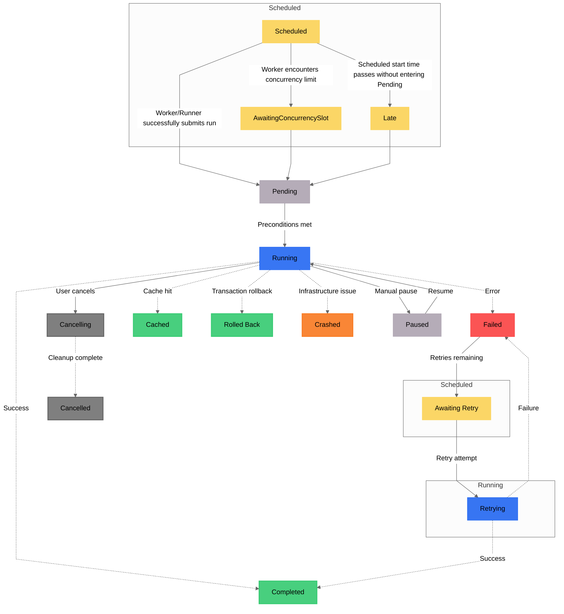

状態は、特定の [タスク](/v3/develop/write-tasks) 実行または [フロー](/v3/develop/write-flows/) 実行のステータスに関する情報を含むリッチオブジェクトです。

タスクまたはフローの現在の状態や状態の履歴を調べることで、そのタスクについて多くのことを知ることができます。
例えば、状態からタスクの状態がわかります。

- 1時間以内に3回目の実行がスケジュールされている
- 成功し、生成されたデータ
- 実行がスケジュールされていたが、後でキャンセルされた
- 再実行ではなく、前回の実行のキャッシュされた結果を使用した
- タイムアウトのため失敗した

<Note>
**実行時にのみ状態が存在します**:
フローとタスクは、システムの処理内容を記述するテンプレートです。システムを**実行** した場合にのみ、状態が発生します。
</Note>

## 状態の種類

Prefect の状態には、名前と種類があります。
状態の名前は、多くの場合、その種類と同義ですが、必ずしもそうとは限りません。
たとえば、初めて実行されるタスク実行の状態は、「実行中」という名前で、種類は「実行中」です。
しかし、タスクが再試行される場合、同じタスク実行の状態は「再試行中」で、種類は「実行中」になります。

種類と名前の違いは微妙です。状態 _type_ は通常、オーケストレーションロジックの基盤として使用され、状態 _name_ は主に視覚的な表示や記録に使用されます。

状態と状態種類の完全なリストは次のとおりです。

| Name | Type | Terminal? | Description
| --- | --- | --- | --- |
| `Scheduled` | `SCHEDULED` | No | 実行は将来の特定の時間に開始されます。 |
| `Late` | `SCHEDULED` | No | 実行の予定開始時刻は過ぎましたが、保留中 (デフォルトでは 15 秒) に移行していません。 |
| <span class="no-wrap">`AwaitingRetry`</span> | `SCHEDULED` | No | コードの問題のため実行は正常に完了せず、再試行回数が残っていました。 |
| `Pending` | `PENDING` | No | 実行は送信されましたが、必要な前提条件が満たされるのを待機しています。 |
| `Running` | `RUNNING` | No | 実行コードが現在実行中です。|
| `Retrying` | `RUNNING` | No | 実行コードは、以前は正常に完了しなかったものの、現在実行中です。 |
| `Paused` | `PAUSED` | No | 実行コードは、続行するための手動承認を受け取るまで実行を停止します。 |
| `Cancelling` | `CANCELLING` | No | コードが実行されていたインフラストラクチャがクリーンアップされています。 |
| `Cancelled` | `CANCELLED` | Yes | ユーザーが実行は完了すべきではないと判断したため、実行は完了しませんでした。 |
| `Completed` | `COMPLETED` | Yes | 実行は正常に完了しました。 |
| `Cached` | `COMPLETED` | Yes | 実行結果は、以前にキャッシュされた値から読み込まれました。 |
| `RolledBack` | `COMPLETED` | Yes | 実行は正常に完了しましたが、トランザクションはロールバックされ、ロールバック フックが実行されました。 |
| `Failed` | `FAILED` | Yes | コードの問題のため実行は完了せず、再試行回数は残っていませんでした。 |
| `Crashed` | `CRASHED` | Yes | インフラストラクチャの問題のため、実行は完了しませんでした。 |

## 状態遷移

フロー実行の状態が変化すると、正常に動作しているかどうかが分かります。
以下に、一般的な状態遷移とその意味を示します。

|    | From | To | Triggered By | Explanation |
| --- | --------------- | ------------ | ----------- | ----------- |
| ✅ | None | Scheduled | Manual run, automation, or schedule | フロー実行が作成され、将来の実行がスケジュールされました。 |
| ✅ | Scheduled | Pending | Worker | ワーカーがフロー実行のインフラストラクチャを開始しようとしています。 |
| ⛔ | Scheduled | Late | Cloud or self-hosted server | 通常、1) 正常なワーカーがいない、2) ワーカーが適切な作業プールまたは作業キューをポーリングしていない、または 3) ワーカーの同時実行が制限されているなどの理由で、ワーカーが実行を引き継がなかったことを意味します。 |
| ✅ | Pending | Running | Worker | インフラストラクチャがプロビジョニングされ、フローが実行されています |
| ⛔ | Pending | Crashed | Worker or runner | 問題が発生しました。考えられる原因としては、1) ワーカーがインフラストラクチャの作成に失敗した、2) コードがストレージに存在しないかワーカーが認証に失敗した、3) コードのインポートが欠落しているか壊れている、あるいは構文エラーがある、などが挙げられます。 |
| ✅ | Running | Completed | Flow run | フローは正常に完了しました。 |
| ⛔ | Running | Failed | Flow run | これは通常、コードで例外が発生したことを意味します。フロー実行ログを確認してください。 |
| ⛔ | Running | Crashed | Worker or flow run | おそらくコード内で例外は発生していないと思われますが、1) メモリ不足エラー、2) ポッドの削除、3) タイムアウトなどのインフラストラクチャの問題である可能性があります。 |

## 最終状態の決定

フローまたはタスク実行の最終状態は、いくつかの要因によって決まります。一般的に、終了状態には3つのカテゴリがあります。
- `COMPLETED`: `COMPLETED` 状態の実行で、エラーや例外が発生せず、正常に終了した場合
- `FAILED`: `FAILED` 状態の実行で、実行中に例外などのエラーが発生した場合
- `CRASHED`: `CRASHED` 状態の実行で、`KeyboardInterrupt` や `SIGTERM` などの OS シグナルによって中断された場合

状態遷移のフローは次のように視覚化できます:

<Note>
状態は名前で表され、状態の背後にあるボックスはその基礎となるタイプを明確に示します。
点線は終端状態を示します。
</Note>



### タスクの戻り値

タスクは、Python オブジェクトを何らかの形で返すと「Completed」状態になります。ただし、例外が 1 つあります。タスクが明示的に「Failed」状態を返す場合、そのタスクは「Failed」としてマークされます。

```python
from prefect import task, flow
from prefect.states import Completed, Failed


@task
def toggle_task(fail: bool):
    if fail:
        return Failed(message="I was instructed to fail.")
    else:
        return Completed(message="I was instructed to succeed.")


@flow
def example():
    # this run will be set to a `Failed` state
    state_one = toggle_task(fail=True)

    # this run will be set to a `Completed` state
    state_two = toggle_task(fail=False)

    # similarly, the flow run will fail because we return a `Failed` state
    return state_one, state_two
```

`return_state` フラグを使用して、フロー内の状態オブジェクトに直接アクセスすることもできます:

```python
from prefect import flow, task


@task
def add_one(x):
    return x + 1


@flow
def my_flow():
    result = add_one(1)
    assert isinstance(result, int) and result == 2

    state = add_one(1, return_state=True)
    assert state.is_completed() is True
    assert state.result() == 2
```

<Tip>
`return_state=True` で `State` を返すことは、タスクまたはフローの終了状態に応じて条件付きで応答したい場合に便利です。
例えば、`if state.is_failed(): ...` のように記述します。
</Tip>


### フロー戻り値

import FinalFlowState from '/snippets/final-flow-state.mdx'

<FinalFlowState />

## 状態変化時にコードを実行する

状態変化フックは、**_クライアント側_** のフローまたはタスク実行状態の変化に応じてコードを実行し、ワークフロー内の特定の状態遷移に対するアクションを定義できます。

状態変化フックのシグネチャは次のとおりです:

```python
def my_task_state_hook(task: Task, run: TaskRun, state: State) -> None:
    ...

def my_flow_state_hook(flow: Flow, run: FlowRun, state: State) -> None:
    ...
```

タスク実行フックとフロー実行フックはどちらも、キーワード引数またはデコレータ構文を通じて指定できます:

```python
from prefect import task, flow

# for type hints only
from prefect import Task
from prefect.client.schemas.objects import TaskRun
from prefect.states import State


def first_task_hook(tsk: Task, run: TaskRun, state: State) -> None:
    if not state.name == 'Cached':
        print('I run anytime this task executes successfully')
    else:
        print('and can condition my behavior on details of this run')


@task(log_prints=True, on_completion=[first_task_hook])
def nice_task(name: str):
    print(f"Hello {name}!")


# alternatively hooks can be specified via decorator
@nice_task.on_completion
def second_hook(tsk: Task, run: TaskRun, state: State) -> None:
    print('another hook')

nice_task(name='Marvin')
```

<Note>
型ヒント用に `TaskRun` または `FlowRun` をインポートするには、`prefect.client.schemas.objects` からインポートできます。
</Note>

状態変更フックは多用途で、同じ状態遷移に対して複数の状態変更フックを指定したり、異なる遷移に対して同じ状態変更フックを使用したりできます:

```python
def my_success_hook(task, task_run, state):
    print("Task run succeeded!")

def my_failure_hook(task, task_run, state):
    print("Task run failed!")

def my_succeed_or_fail_hook(task, task_run, state):
    print("If the task run succeeds or fails, this hook runs.")

@task(
    on_completion=[my_success_hook, my_succeed_or_fail_hook],
    on_failure=[my_failure_hook, my_succeed_or_fail_hook]
)
```

### 利用可能な状態変更フック

| Type | Flow | Task | Description |
| ----- | --- | --- | --- |
| `on_completion` | ✓ | ✓ | フローまたはタスクの実行が「完了」状態になったときに実行されます。 |
| `on_failure` | ✓ | ✓ | フローまたはタスクの実行が「失敗」状態になったときに実行されます。 |
| <span class="no-wrap">`on_cancellation`</span> | ✓ | - | フロー実行が「キャンセル」状態になったときに実行されます。 |
| `on_crashed` | ✓ | - | フロー実行が「クラッシュ」状態になったときに実行されます。 |
| `on_running` | ✓ | - | フロー実行が「実行中」状態になったときに実行されます。 |

<Note>
タスクの「on_rollback」フックは、正式な状態変更フックではなく、トランザクションライフサイクルフックであることに注意してください。
ロールバックフックは、タスクのトランザクションを表す1つの引数を受け取ります。
</ Note>

### 状態変更フックに `kwargs` を渡す

`with_options` メソッドを組み合わせることで、任意の `**kwargs` をフックに効果的に渡すことができます:

```python
from functools import partial
from prefect import flow, task

data = {}

def my_hook(task, task_run, state, **kwargs):
    data.update(state=state, **kwargs)

@task
def bad_task():
    raise ValueError("meh")

@flow
def ok_with_failure_flow(x: str = "foo", y: int = 42):
    bad_task_with_a_hook = bad_task.with_options(
        on_failure=[partial(my_hook, **dict(x=x, y=y))]
    )
    # return a tuple of "bar" and the task run state
    # to avoid raising the task's exception
    return "bar", bad_task_with_a_hook(return_state=True)

_, task_run_state = ok_with_failure_flow()

assert data == {"x": "foo", "y": 42, "state": task_run_state}
```

### 使用例: フロー実行が失敗したときに通知を送信する

状態変更フックを使用すると、タスクが状態遷移するときに送信されるメッセージをカスタマイズできます。例えば、タスクが「失敗」状態になったときに機密情報を含む通知を送信するなどです。

以下は、フロー実行が「失敗」状態になったときにクライアント側フックを実行する例です:

```python
from prefect import flow
from prefect.blocks.core import Block
from prefect.settings import PREFECT_API_URL

def notify_slack(flow, flow_run, state):
    slack_webhook_block = Block.load(
        "slack-webhook/my-slack-webhook"
    )

    slack_webhook_block.notify(
        (
            f"Your job {flow_run.name} entered {state.name} "
            f"with message:\n\n"
            f"See <https://{PREFECT_API_URL.value()}/flow-runs/"
            f"flow-run/{flow_run.id}|the flow run in the UI>\n\n"
            f"Tags: {flow_run.tags}\n\n"
            f"Scheduled start: {flow_run.expected_start_time}"
        )
    )

@flow(on_failure=[notify_slack], retries=1)
def failing_flow():
    raise ValueError("oops!")

if __name__ == "__main__":
    failing_flow()
```

この例では再試行が設定されていることに注意してください。つまり、フロー実行が「失敗」状態になった場合、すべての「再試行」が完了するまで「on_failure」フックは実行されません。
