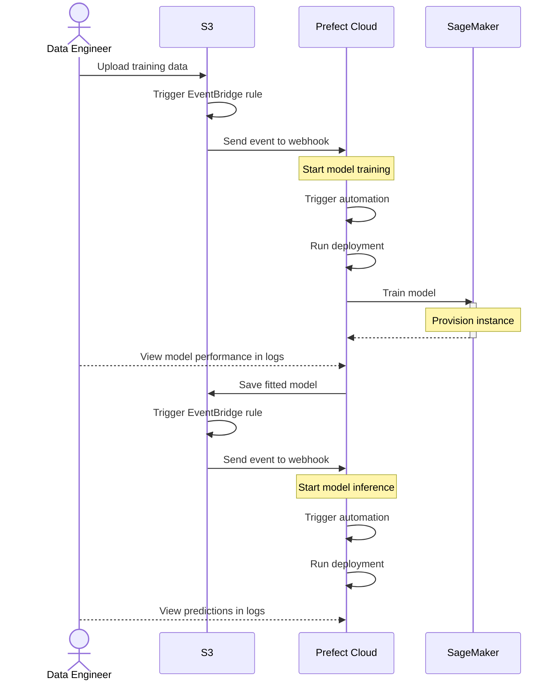

[ウェブサイトからデータを抽出する](/v3/tutorials/scraping)チュートリアルでは、データの依存関係を処理し、大量のデータを取り込む方法を学習しました。
次は、データを使用して機械学習モデルをトレーニングする方法を学習します。
構築するパイプラインは次のとおりです。



## 前提条件

* 無料の [Prefect Cloud アカウント](https://app.prefect.cloud) と API キー
* [Prefect SDK](/v3/get-started/install)
* 以下のものを含む AWS アカウント
    * SageMaker を使用して `ml.g4dn.xlarge` インスタンスを作成する権限。
    * S3 と SageMaker へのフルアクセス権を持つアクセスキー。
* オプション: [Terraform](https://developer.hashicorp.com/terraform/install)

## Prefect Cloud にログイン

必要に応じて、Prefect Cloud アカウントにログインしてください。

```bash
prefect cloud login
```

## ワークプールを作成する

Prefect Cloud に「my-work-pool」という名前の新しいプロセスワークプールを作成します。

```bash
prefect work-pool create my-work-pool --type process
```

次に、別のターミナルで、その作業プール内のワーカーを起動します。

```bash
prefect worker start --pool my-work-pool
```

チュートリアルの残りの間、このワーカーを実行したままにしておきます。

## デプロイメントの作成

Prefect Cloud にデプロイするフローコードを含むリポジトリをクローンします。

```bash
git clone https://github.com/PrefectHQ/demos.git
cd demos/
```

次に、`model-training` フローを Prefect Cloud にデプロイします。
このフローは、SageMaker を使用して [Iris データセット](https://archive.ics.uci.edu/dataset/53/iris) 上の [XGBoost モデル](https://github.com/dmlc/xgboost) をトレーニングします。

```bash
python model_training.py
```

<Expandable title="model training flow">
これは、Prefect Cloud にデプロイしたフローです。

{/* pmd-metadata: notest */}
```python
from prefect import flow, task
from prefect_aws import AwsCredentials
from prefect.cache_policies import NONE
from prefect.blocks.system import Secret
import sagemaker
from sagemaker.xgboost.estimator import XGBoost
import boto3
from sagemaker.session import Session
from typing import TypedDict, Union

class TrainingInputs(TypedDict):
    train: str
    validation: str

@task(log_prints=True)
def get_sagemaker_session(aws_credentials: AwsCredentials) -> Session:
    """Create a SageMaker session using AWS credentials."""
    boto_session = boto3.Session(
        aws_access_key_id=aws_credentials.aws_access_key_id,
        aws_secret_access_key=aws_credentials.aws_secret_access_key.get_secret_value(),
        region_name=aws_credentials.region_name
    )
    return sagemaker.Session(boto_session=boto_session)

@task
def get_training_inputs(data_bucket: str) -> TrainingInputs:
    """Get the S3 paths for training and test data."""
    return {
        "train": f"s3://{data_bucket}/train.csv",
        "validation": f"s3://{data_bucket}/test.csv"
    }

@task
def create_training_script(model_bucket: str) -> None:
    """Create the training script dynamically from template"""
    # Read the template
    with open("templates/sagemaker_script_template.py", "r") as f:
        training_script = f.read()

    # Format the script with the model bucket
    training_script = training_script.format(model_bucket=model_bucket)

    # Write the formatted script
    with open("train.py", "w") as f:
        f.write(training_script)

@task(cache_policy=NONE)
def create_xgboost_estimator(sagemaker_session: Session, role_arn: str) -> XGBoost:
    """Create and configure the XGBoost estimator."""
    hyperparameters = {
        "max_depth": 5,
        "eta": 0.2,
        "gamma": 4,
        "min_child_weight": 6,
        "subsample": 0.8,
        "objective": "multi:softmax",
        "num_class": 3,
        "num_round": 100,
        "tree_method": "gpu_hist"
    }

    return XGBoost(
        entry_point="train.py",
        hyperparameters=hyperparameters,
        role=role_arn,
        instance_count=1,
        instance_type="ml.g4dn.xlarge",
        framework_version="1.7-1",
        py_version="py3",
        sagemaker_session=sagemaker_session
    )

@flow(log_prints=True)
def train_model(data_bucket: Union[str, None] = None, model_bucket: Union[str, None] = None) -> XGBoost:
    """Main flow to train XGBoost model on Iris dataset using SageMaker."""
    data_bucket = data_bucket or "prefect-ml-data"
    model_bucket = model_bucket or "prefect-model"

    # Load AWS credentials from Prefect Block
    aws_credentials = AwsCredentials.load("aws-credentials")
    
    # Get SageMaker role ARN from Prefect Secret Block
    role_arn = Secret.load("sagemaker-role-arn").get()
    
    # Create SageMaker session
    sagemaker_session = get_sagemaker_session(aws_credentials)

    # Get training inputs
    training_inputs = get_training_inputs(data_bucket)
    create_training_script(model_bucket)
    
    # Create and train estimator
    estimator = create_xgboost_estimator(sagemaker_session, role_arn)

    estimator.fit(training_inputs, wait=True)
    
    return estimator
```
</Expandable>

<Expandable title="SageMaker script template">
これは、SageMaker がモデルをトレーニングするために使用するスクリプトのテンプレートです。

{/* pmd-metadata: notest */}
```python
import argparse
import boto3
import os
import json
import pandas as pd
import numpy as np
import xgboost as xgb
from sklearn.preprocessing import LabelEncoder

if __name__ == "__main__":
    parser = argparse.ArgumentParser()

    # Hyperparameters are described here.
    parser.add_argument(
        "--max_depth",
        type=int,
    )
    parser.add_argument("--eta", type=float)
    parser.add_argument("--gamma", type=float)
    parser.add_argument("--min_child_weight", type=float)
    parser.add_argument("--subsample", type=float)
    parser.add_argument("--verbosity", type=int)
    parser.add_argument("--objective", type=str)
    parser.add_argument("--num_round", type=int)
    parser.add_argument("--tree_method", type=str, default="auto")
    parser.add_argument("--predictor", type=str, default="auto")
    parser.add_argument("--num_class", type=int)

    # Sagemaker specific arguments. Defaults are set in the environment variables.
    parser.add_argument("--output-data-dir", type=str, default=os.environ["SM_OUTPUT_DATA_DIR"])
    parser.add_argument("--model-dir", type=str, default=os.environ["SM_MODEL_DIR"])
    parser.add_argument("--train", type=str, default=os.environ["SM_CHANNEL_TRAIN"])
    parser.add_argument("--validation", type=str, default=os.environ["SM_CHANNEL_VALIDATION"])
    parser.add_argument("--num-round", type=int, default=100)

    args, _ = parser.parse_known_args()

    # Load training and validation data with appropriate column names
    column_names = ['sepal_length', 'sepal_width', 'petal_length', 'petal_width', 'target']
    train_data = pd.read_csv(os.path.join(args.train, "train.csv"), 
                            names=column_names, 
                            header=None)
    validation_data = pd.read_csv(os.path.join(args.validation, "test.csv"), 
                                names=column_names, 
                                header=None)

    # For XGBoost, we need to convert the text labels to numeric values
    # Create a label encoder
    label_encoder = LabelEncoder()
    y_train = label_encoder.fit_transform(train_data['target'])
    y_validation = label_encoder.transform(validation_data['target'])

    # Get features (all columns except target)
    X_train = train_data.drop('target', axis=1)
    X_validation = validation_data.drop('target', axis=1)

    # Create DMatrix for XGBoost
    dtrain = xgb.DMatrix(X_train, label=y_train)
    dvalidation = xgb.DMatrix(X_validation, label=y_validation)

    hyperparameters = {{
        "max_depth": args.max_depth,
        "eta": args.eta,
        "gamma": args.gamma,
        "min_child_weight": args.min_child_weight,
        "subsample": args.subsample,
        "verbosity": args.verbosity,
        "objective": args.objective,
        "tree_method": args.tree_method,
        "predictor": args.predictor,
        "num_class": args.num_class
    }}

    # Train the model
    watchlist = [(dtrain, "train"), (dvalidation, "validation")]
    model = xgb.train(
        hyperparameters,
        dtrain,
        num_boost_round=args.num_round,
        evals=watchlist,
        early_stopping_rounds=10
    )

    # Save the model
    filename = "xgboost-model"
    model_location = os.path.join(args.model_dir, filename)
    model.save_model(model_location)

    # Save the model parameters
    hyperparameters_location = os.path.join(args.model_dir, "hyperparameters.json")
    with open(hyperparameters_location, "w") as f:
        json.dump(hyperparameters, f)

    # Upload the model to an S3 bucket for inference using boto3
    s3_client = boto3.client('s3')
    bucket_name = "{model_bucket}"
    s3_client.upload_file(
        model_location,
        bucket_name,
        filename
    )
```
</Expandable>

次に、Prefect Cloud に `model-inference` フローをデプロイします。
このフローは、S3 から適合されたモデルを使用してパフォーマンスメトリクスを計算します。

```bash
python model_inference.py
```

<Expandable title="model inference flow">
これは、Prefect Cloud にデプロイしたフローです。

{/* pmd-metadata: notest */}
```python
from prefect import flow, task
from prefect_aws import S3Bucket
import xgboost as xgb
import numpy as np
import tempfile
import os
from typing import Union

# Load the saved model:
@task
def load_model(filename: str) -> xgb.Booster:
    """Load a saved XGBoost model from S3"""

    # Get the S3 bucket block
    s3_bucket = S3Bucket.load("s3-bucket-block")

    # Create a temporary file to store the model
    with tempfile.NamedTemporaryFile(delete=False) as temp_file:
        temp_path = temp_file.name
        
        # Download the model file
        s3_bucket.download_object_to_path(
            from_path=filename,
            to_path=temp_path
        )
        
        # Load the XGBoost model
        model = xgb.Booster()
        model.load_model(temp_path)
    
    # Clean up the temporary file
    os.unlink(temp_path)

    return model

# Run inference with loaded model:
@task
def predict(model: xgb.Booster, X: Union[list[list[float]], np.ndarray]) -> np.ndarray:
    """Make predictions using the loaded model
    Args:
        model: Loaded XGBoost model
        X: Features array/matrix in the same format used during training
    """
    # Convert input to DMatrix (optional but recommended)
    dtest = xgb.DMatrix(np.array(X))
    # Get predictions
    predictions = model.predict(dtest)
    return predictions

@flow(log_prints=True)
def run_inference(samples: Union[list[list[float]], None] = None) -> None:
    samples = samples or [[5.0,3.4,1.5,0.2], [6.4,3.2,4.5,1.5], [7.2,3.6,6.1,2.5]]
    model = load_model('xgboost-model')
    predictions = predict(model, samples)
    for sample, prediction in zip(samples, predictions):
        print(f"Prediction for sample {sample}: {prediction}")
```
</Expandable>

## クラウドリソースのプロビジョニング

import { home } from "/snippets/resource-management/vars.mdx"

このチュートリアルでは、AWS S3 と EventBridge を使用してデータを保存し、イベントを発行します。また、Prefect の Webhook と自動化を使用してフローをトリガーします。
<a href={home.tf}>Terraform</a> を使用するため、これらのリソースを手動でプロビジョニングする必要はありません。

以下の環境変数を設定します。

```bash
# Prefect auth
export PREFECT_API_KEY=<Your Prefect API key>
export PREFECT_CLOUD_ACCOUNT_ID=<Your account ID>

# AWS auth
export AWS_ACCESS_KEY_ID=<Your AWS access key ID>
export AWS_SECRET_ACCESS_KEY=<Your AWS secret access key>
export AWS_REGION=us-east-1

# Terraform variables
export TF_VAR_prefect_workspace_id=<Your workspace ID>
export TF_VAR_data_bucket_name=prefect-ml-data # You may need to change this if the bucket name is already taken
export TF_VAR_model_bucket_name=prefect-model  # ...
export TF_VAR_model_training_deployment_id=<Your model-training deployment ID>
export TF_VAR_model_inference_deployment_id=<Your model-inference deployment ID>
```

`infra/` ディレクトリに切り替えます。

```bash
cd infra/
```

これらのリソースを Terraform でプロビジョニングします。

```bash
terraform init
terraform apply
```

<Note>
これらのリソースを完全に削除する準備ができたら、`prefect-ml-data` バケットと `prefect-model` バケットを空にして、ターミナルで `terraform destroy` を実行します。
</Note>

### 代替案：手動プロビジョニング

Terraform を使用しない場合は、リソースを手動で作成できます。

<Expandable title="manual instructions">

#### モデルトレーニング用のWebhookを作成します。

Prefect Cloudで、「model-training」という名前のWebhookを作成します。

* Webhook認証を強制するために、「s3」という名前の新しいサービスアカウントを作成します（APIキーは安全な場所に保存してください）。
* 以下の静的テンプレートを使用します。

```json
{
    "event": "webhook.called",
    "resource": {
        "prefect.resource.id": "webhook.resource.id"
    }
}
```

この Webhook の URL は後で必要になるのでメモしておいてください。

#### モデル推論用のWebhookを作成します。

Prefect Cloudで、「model-inference」という名前のWebhookを作成します。

* モデルトレーニング用のWebhook用に作成したものと同じサービスアカウントを使用できます。
* 以下の静的テンプレートを使用します。

```json
{
    "event": "webhook.called",
    "resource": {
        "prefect.resource.id": "webhook.resource.id"
    }
}
```

この Webhook の URL は後で必要になるのでメモしておいてください。

#### モデルトレーニング用の自動化を作成します。

Prefect Cloud で、**カスタム** トリガータイプの自動化を作成します。

* `model-training` Webhook から `webhook.called` に一致するイベントが発生した場合にトリガーします。
Webhook は関連リソースであるため、**JSON** タブに移動し、`prefect.resource.id` セクションを `match` 配列から `match_related` 配列に移動する必要があります。
* 1 分以内にそのイベントが 1 回発生した場合にトリガーします（これにより、ファイルのバッチがアップロードされたときにモデルのトレーニングが 1 回だけ実行されます）。
* この自動化がトリガーされるたびに、`train-model > model-training` デプロイメントを実行します。
    * このチュートリアルで使用されているものとは異なるバケット名を使用する場合のみ、`data_bucket` および `model_bucket` パラメータを変更します。
* この自動化の名前を `train-model` にします。

#### モデル推論の自動化を作成します。

Prefect Cloud で、**カスタム** トリガータイプの自動化を作成します。

* `model-inference` Webhook から `webhook.called` に一致するイベントが発生した場合にトリガーします。
前と同様に、**JSON** タブを使用して、`prefect.resource.id` セクションを `match` 配列から `match_related` 配列に移動する必要があります。
* 1 分以内にそのイベントが 1 回発生した場合にトリガーします（これにより、ファイルのバッチがアップロードされたときにモデルのトレーニングが 1 回だけ実行されます）。
* この自動化がトリガーされるたびに、`run-inference > model-inference` デプロイメントを実行します。
* この自動化に `run-inference` という名前を付けます。

#### S3 バケットの作成

データとモデルは S3 に保存されます。
AWS に以下のバケットを作成します。

* トレーニングデータとテストデータを保存するための `prefect-ml-data` バケットを作成します。
* トレーニング済みモデルを保存するための `prefect-model` バケットを作成します。
* これらのバケット内のすべてのイベントに対して EventBridge 通知を有効にします。

<Note>
すでに使用されている場合は、別の S3 バケット名を選択する必要がある場合があります。
</Note>

#### トレーニング用の EventBridge ルールを作成する

AWS で、「training-data-changed」という名前の EventBridge ルールを作成し、新しいオブジェクトが「prefect-ml-data」バケットにアップロードされるたびにモデルのトレーニングをトリガーします。

* イベントパターン：

```json
{
  "source": ["aws.s3"],
  "detail-type": ["Object Created"],
  "detail": {
    "bucket": {
      "name": ["prefect-ml-data"]
    }
  }
}
```

* ターゲット:
`model-training-webhook` という名前の EventBridge API 宛先。Prefect Cloud で作成した `model-training` Webhook のエンドポイントに設定します。
    * HTTP POST メソッドを使用します。
    * Webhook で認証するには、`prefect-webhooks` という名前の新しい接続を作成し、**API キー** を使用するように認証を構成し、**API キー名** を `Authorization`、**値** を `Bearer <service-account-api-key>` に設定します。
    <Note>
    サービス アカウント API キーは、Prefect Cloud の `s3` サービス アカウント用に作成した API キーです。
    </Note>

#### 推論用の EventBridge ルールを作成する

AWS で、`prefect-model` バケットに新しいオブジェクトがアップロードされるたびにモデル推論をトリガーする `model-changed` という EventBridge ルールを作成します。

* イベントパターン:

```json
{
  "source": ["aws.s3"],
  "detail-type": ["Object Created"],
  "detail": {
    "bucket": {
      "name": ["prefect-model"]
    }
  }
}
```
* ターゲット:
`model-inference-webhook` という名前の EventBridge API 宛先を作成し、先ほど作成した `model-inference` Webhook のエンドポイントに設定します。
`training-data-changed` ルール用に作成した接続を再利用できます。

#### S3 と SageMaker 用の IAM ロールを作成します。

Prefect フローは、作成した AWS リソースにアクセスする必要があります。
`Amazon SageMaker Full Access` ポリシーと `Amazon S3 Full Access` ポリシーを含む「prefect-tutorial」という名前の IAM ロールを作成します。
ロールの ARN は後で必要になるので、メモしておいてください。
</Expandable>

## AWS リソースへのアクセスを許可

Prefect フローは、プロビジョニングした AWS リソースにアクセスする必要があります。
Prefect Cloud で以下のブロックを作成します。

* `aws-credentials` という名前の **AWS Credentials** ブロック。
`AWS Access Key ID` フィールドと `AWS Access Key Secret` フィールドを、先ほど作成したアクセスキーの値に設定します。
* `s3-bucket-block` という名前の **S3 Bucket** ブロック。モデルバケットの名前（デフォルトでは `prefect-model`）に設定します。
このブロックでは、先ほど作成した `aws-credentials` ブロックを使用できます。
* `sagemaker-role-arn` という名前の **Secret** ブロック。
このブロックには、先ほど作成した SageMaker の IAM ロール ARN が格納されます。

これで、Prefect Cloud でフローを実行する際に、これらのブロックを使用して AWS で認証できるようになります。

## MLパイプラインのテスト

AWSコンソールを使用して、以下のファイルを`prefect-ml-data`バケットにアップロードします。

* [train.csv](https://raw.githubusercontent.com/PrefectHQ/demos/refs/heads/main/datasets/train.csv)
* [test.csv](https://raw.githubusercontent.com/PrefectHQ/demos/refs/heads/main/datasets/test.csv)

ファイルのアップロード後、`train-model`フローが自動的に実行されます。
Prefect Cloudでフロー実行の詳細を開き、モデルのトレーニングログを確認してください。
トレーニングには数分かかります。

```
...
[43]#011train-mlogloss:0.18166#011validation-mlogloss:0.24436
[44]#011train-mlogloss:0.18166#011validation-mlogloss:0.24436
[45]#011train-mlogloss:0.18168#011validation-mlogloss:0.24422
[46]#011train-mlogloss:0.18166#011validation-mlogloss:0.24443
[47]#011train-mlogloss:0.18166#011validation-mlogloss:0.24443
[48]#011train-mlogloss:0.18165#011validation-mlogloss:0.24458

2024-12-20 20:16:56 Completed - Training job completed

Training seconds: 101
Billable seconds: 101
Memory usage post-training: total - 17179869184, percent - 78.2%
Finished in state Completed()
```

トレーニングが完了すると、モデルは「prefect-model」バケットにアップロードされ、「run-inference」フローがトリガーされます。
推論は完了するまで数秒かかり、完了後、フローログで予測結果を確認できます。

```
...
Prediction for sample [5.0, 3.4, 1.5, 0.2]: 0.0
Prediction for sample [6.4, 3.2, 4.5, 1.5]: 1.0
Prediction for sample [7.2, 3.6, 6.1, 2.5]: 2.0
Finished in state Completed()
```

## 次のステップ

このチュートリアルでは、S3 にデータをパブリッシュし、データが変更されるたびに機械学習モデルをトレーニングする方法を学習しました。
Prefect のエキスパートへの道を着実に歩み始めています！

このチュートリアルシリーズを終えたら、以下のトピックを深く掘り下げて学習を続けましょう。

- [フロー](/v3/develop/write-flows) と [タスク](/v3/develop/write-tasks) を作成する
- [Prefect Cloud とサーバーインスタンス](/v3/manage) を管理する
- Kubernetes、Docker、サーバーレスインフラストラクチャを使用して、[ワークプール](/v3/deploy/infrastructure-concepts/work-pools) でワークフローを実行する

<Tip>
サポートが必要ですか? Prefect 製品アドボケートとの[ミーティングを予約](https://calendly.com/prefect-experts/prefect-product-advocates?utm_campaign=prefect_docs_cloud&utm_content=prefect_docs&utm_medium=docs&utm_source=docs)して、ご質問にお答えします。
</Tip>
